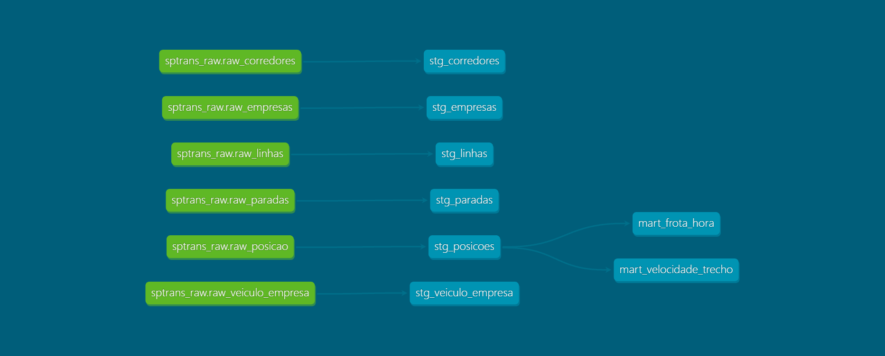

# Pipeline de dados — frota de ônibus de São Paulo

Coleta contínua da API Olho Vivo (SPTrans), modelagem em camadas e análise da
operação da frota municipal.

A ideia não era descobrir algo inédito sobre o trânsito de São Paulo, e sim
montar a estrutura que permitiria descobrir: uma coleta que roda sozinha,
sobrevive a falha e reinício, e entrega dado consistente para análise sem eu
precisar mexer. A janela de dados é curta e está descrita abaixo.

**Stack:** Apache Airflow 3.3 · PostgreSQL 16 · dbt Core 1.12 · Docker Compose · Python

---

## Como funciona

```
API Olho Vivo (SPTrans)
   │  autenticação por sessão: POST /Login/Autenticar → cookie
   │
   ├─ 5 DAGs de dimensão   →  UPSERT   (ON CONFLICT DO UPDATE)
   └─ 1 DAG de fato        →  APPEND   (ON CONFLICT DO NOTHING)
   │     coleta a cada 10 min
   ▼
┌──────────────────────────────────────────────────────────┐
│ BRONZE — schema sptrans_raw                              │
│ raw_posicao · raw_linhas · raw_paradas · raw_empresas    │
│ raw_corredores · raw_veiculo_empresa · etl_execucao      │
└──────────────────────────────────────────────────────────┘
   │  dbt (disparado pelo Airflow)
   ▼
┌──────────────────────────────────────────────────────────┐
│ SILVER — schema sptrans_staging (views)                  │
│ tipagem, fuso horário, limpeza, filtros de sanidade      │
└──────────────────────────────────────────────────────────┘
   ▼
┌──────────────────────────────────────────────────────────┐
│ GOLD — schema sptrans_marts (tabelas)                    │
│ mart_frota_hora · mart_velocidade_trecho                 │
└──────────────────────────────────────────────────────────┘
```



A API não guarda histórico: cada chamada devolve só a posição da frota naquele
instante. Qualquer pergunta sobre velocidade, regularidade ou variação ao longo
do dia depende de acumular observações, e é isso que o pipeline faz.

---

## Os dados

| | |
|---|---|
| Observações de posição | 3.415.787 |
| Veículos distintos | 13.432 |
| Linhas-sentido | 2.662 |
| Tamanho da tabela de fato | 450 MB |

**De quando são.** A coleta rodou de forma intermitente entre 8 e 29 de setembro
de 2026. Três dias úteis ficaram com cobertura completa ou quase — 08/09
(terça), 28/09 (segunda) e 29/09 (terça) — e são os únicos que uso na análise.
Também tenho o domingo 27/09 a partir das 18h, que aproveito só para comparar a
noite. O resto dos dias tem cobertura pequena demais e ficou de fora.

Nenhum dos três dias completos cobre o intervalo entre 3h e 7h, então a curva de
frota tem um buraco aí.

---

## Decisões que tomei

### Por que a coleta pode rodar duas vezes sem duplicar nada

Cada observação é identificada por `(prefixo_veiculo, ta_utc)` — o número do
veículo e o instante em que ele transmitiu a posição. Essa chave veio do próprio
dado, não foi inventada por mim.

Na prática isso significa que posso repetir uma coleta sem medo: os veículos que
não transmitiram nada de novo entre duas execuções colidem na chave e são
descartados pelo `ON CONFLICT DO NOTHING`. É o que torna seguro o retry
automático, a re-execução manual e a volta depois de uma queda — três coisas que
aconteceram de verdade durante o desenvolvimento.

As dimensões usam `ON CONFLICT DO UPDATE`, porque uma linha ou empresa pode
mudar de nome. O fato usa `DO NOTHING`, porque um evento que já aconteceu não
muda mais.

### O que vai em cada camada

A regra que usei para decidir onde cada transformação entra: *se eu errar isso,
perco o dado original?*

- **Bronze** fica com o que a API mandou. Traduzi os nomes crípticos (`cl` virou
  `codigo_linha`), mas não converti nem filtrei nada.
- **Silver** decide o que dá para usar: converte fuso, tipa, limpa espaço
  sobrando, joga fora registro impossível.
- **Gold** agrega para responder as perguntas.

O exemplo concreto é o fuso horário. A API manda o timestamp em UTC, e a
conversão para o horário de Brasília acontece na silver, não na ingestão. Se eu
errar a conversão, corrijo e rodo de novo — o `ta_utc` original continua
intacto na bronze.

### Dois filtros que nasceram de problema real no dado

```sql
where latitude  between -24.1 and -23.3
  and longitude between -47.0 and -46.3
  and ta_utc >= ingested_at - interval '15 minutes'
  and ta_utc <= ingested_at + interval '2 minutes'
```

O filtro de tempo apareceu porque o mart de frota mostrava "1 veículo" em
horários em que não havia operação. Fui olhar o registro: era um ônibus cujo GPS
parou de transmitir, e a API continuou servindo a última posição conhecida com o
timestamp congelado. Num caso, por mais de um mês.

O filtro de coordenada não descarta nada hoje — zero registros fora da caixa.
Deixei porque não custa nada e protege contra o erro de GPS que ainda não
apareceu. E agora posso dizer que verifiquei, em vez de supor.

### Quando uma parte falha, o resto continua

A DAG que associa veículo a operadora percorre 27 empresas, uma chamada para
cada. Quatro delas devolvem erro 500 sempre. Se eu deixasse a execução inteira
cair por causa disso, a tabela ficaria vazia para sempre.

```python
for codigo in empresas:
    try:
        resp = sessao.get(...)
        resp.raise_for_status()
    except Exception as e:
        falhas.append((codigo, str(e)[:120]))
        continue

if len(falhas) > len(empresas) / 2:
    raise RuntimeError(f"Falha em {len(falhas)} de {len(empresas)} empresas")
```

Cada falha fica registrada e a varredura segue, mas se mais da metade falhar a
task quebra. Sem esse limite, o pipeline entregaria dado incompleto por meses
sem ninguém perceber.

### Quando vale paralelizar e quando não vale

A coleta de paradas faz 1.896 chamadas. Usei Dynamic Task Mapping para quebrar
em lotes de 50, com retry individual por lote e `max_active_tasks=4` para não
martelar uma API pública de terceiro.

A coleta de empresas faz 27 chamadas e usa um laço simples. Criar 27 tasks
custaria mais em agendamento do que o próprio trabalho.

### Guardar o histórico de cada execução

A tabela `etl_execucao` grava toda execução da coleta: status, quantos registros
vieram da API, quantos sobraram depois de deduplicar e quantos realmente foram
gravados.

Isso resolve um problema específico — saber a diferença entre *"não havia ônibus
circulando"* e *"não rodou coleta"*. Sem esse registro, um vale no gráfico de
frota é ambíguo e eu não teria como ser honesto sobre os próprios buracos.

Esses três números também me deixaram escolher a frequência de coleta com
medição em vez de chute. Comparando quantas observações novas chegavam a cada
execução, dava para ver que a frota transmite a cada 85 segundos e que coletar
de 10 em 10 minutos joga fora uns 90% do que estava disponível. Foi uma troca
consciente entre resolução e espaço em disco.

---

## Qualidade

São 14 testes no dbt, com severidades diferentes:

| Teste | Onde | Severidade |
|---|---|---|
| `not_null`, `unique` | chave primária de todas as dimensões | error |
| `accepted_values` | `sentido_descricao`, `tipo_dia` | error |
| `relationships` | `stg_posicoes.codigo_linha` → `stg_linhas` | warn |
| `not_null` | `stg_paradas.nome_parada` | warn |

A diferença entre `error` e `warn` importa. Dois defeitos eu conheço, medi e
aceitei:

**Posições apontando para linha inexistente (~0,2%).** Linhas entram em operação
entre duas atualizações da dimensão, então ficam posições apontando para linha
que ainda não foi cadastrada. Passar a DAG de dimensões de uma vez por dia para
a cada 4 horas derrubou isso de 771 para 236 registros. O que sobrou é atraso
residual mesmo.

**Três paradas sem nome.** Cadastro incompleto da SPTrans — endereço e
coordenada estão lá, só o nome ficou em branco. Tratei com `nullif` na silver.

Um teste que quebra a build por causa de um defeito que eu já conheço e aceito
acaba sendo desligado em duas semanas. Deixar como `warn` mantém ele vivo e
visível.

Último build: `PASS=20 WARN=2 ERROR=0`.

---

## O que os dados mostram

### Quantos ônibus circulam ao longo do dia

Média dos três dias úteis completos:

| Hora | Veículos | | Hora | Veículos |
|---|---|---|---|---|
| 00 | 2.814 | | 14 | 10.090 |
| 01 | 1.609 | | 15 | 10.497 |
| 02 | 1.066 | | 16 | 11.122 |
| 08 | **11.644** | | 17 | 11.567 |
| 09 | 11.493 | | 18 | **11.689** |
| 10 | 11.116 | | 19 | 11.343 |
| 11 | 10.703 | | 20 | 10.583 |
| 12 | 10.327 | | 21 | 9.439 |
| 13 | 10.106 | | 22 | 8.066 |
| | | | 23 | 6.457 |

Dois picos, com o da tarde (18h) um pouco maior que o da manhã (8h), e um vale
de 1.599 ônibus às 14h. A madrugada não zera: às 2h ainda tem 1.066 veículos na
rua.

A diferença entre os três dias é pequena — na maioria das horas, menos de 1,5%
entre o menor e o maior valor. Isso diz tanto sobre a regularidade da operação
quanto sobre a estabilidade da coleta.

### Velocidade: dois tipos de lentidão

Calculo a velocidade derivando a distância entre observações seguidas do mesmo
veículo (`LAG()` particionado por prefixo, fórmula de Haversine sobre as
coordenadas) e dividindo pelo intervalo de tempo. São duas métricas, porque elas
respondem coisas diferentes:

- **Comercial** — todas as medições, inclusive as paradas. É o que o passageiro
  sente de ponta a ponta.
- **Em movimento** — só as medições acima de 1 km/h. É o estado do trânsito.

| Hora | Comercial | Em movimento | % parado |
|---|---|---|---|
| 08 | 8,9 | 10,9 | 20,6% |
| 11 | 6,9 | 10,2 | 31,7% |
| 14 | 7,8 | 10,1 | 25,0% |
| 17 | 7,7 | 8,8 | 15,7% |
| **18** | 7,5 | **8,5** | **15,0%** |
| 21 | 6,7 | 12,1 | 35,9% |
| 23 | 10,0 | 13,6 | 26,1% |

O resultado estranho está nas 18h: é o horário com mais ônibus na rua, a menor
velocidade em movimento **e** a menor proporção de tempo parado.

São dois tipos de lentidão diferentes. De manhã o ônibus anda razoavelmente bem
(10,2 km/h) mas para muito — 31,7% do tempo, entre embarque, semáforo e
terminal. No fim da tarde ele quase não para, só que se arrasta a 8,5 km/h.
Fila contínua.

Olhando só a velocidade comercial isso ficaria escondido, porque os dois efeitos
se anulam no agregado: 6,9 às 11h contra 7,5 às 18h sugeriria que a manhã é
pior, quando não é.

### Domingo contra dia útil

Comparação limitada à faixa das 18h às 23h, a única com cobertura nos dois:

| Hora | Dia útil | Domingo | Razão |
|---|---|---|---|
| 18 | 11.689 | 5.316 | 45% |
| 19 | 11.343 | 5.188 | 46% |
| 20 | 10.583 | 4.972 | 47% |
| 21 | 9.439 | 4.669 | 49% |
| 22 | 8.066 | 4.240 | 53% |
| 23 | 6.457 | 3.781 | 59% |

No começo da noite o domingo opera com menos da metade da frota, mas a diferença
vai encolhendo: o dia útil recolhe os ônibus mais rápido. Às 23h a razão já está
em 59%.

### Um ranking que estava errado

A primeira versão do ranking de "linhas mais lentas no pico da manhã" colocou no
topo duas linhas com 3,0 e 3,7 km/h. As outras treze ficavam entre 7 e 11, então
essas duas estavam muito fora da curva.

Agrupei as observações de velocidade zero dessas linhas por célula geográfica de
uns 100 metros. As paradas se concentravam em duas ou três células, nos extremos
do trajeto. Congestionamento espalha a lentidão ao longo do caminho;
concentração num ponto só é ônibus parado em terminal.

Recalculando por velocidade em movimento, as duas saem do topo (11,1 e 11,3
km/h) e o ranking passa a refletir trânsito de verdade, não tempo de terminal.

Se eu tivesse publicado a primeira versão, teria afirmado uma coisa falsa com
cara de rigor.

---

## Limitações

1. **A velocidade é aproximada.** A distância em linha reta entre duas
   observações é menor que o trajeto real, e o erro aumenta conforme o intervalo
   entre coletas. Os valores servem para comparar horários e linhas entre si,
   não como número absoluto.

2. **O endpoint de paradas cobre só uns 24% das linhas.** Medido: 461 de 1.896
   linhas-sentido devolvem paradas, e pelos nomes dá para ver que são só
   corredor e terminal, não ponto de calçada. Isso inviabiliza calcular
   intervalo entre ônibus a partir do cadastro.

3. **Quatro das 27 operadoras devolvem erro 500** no endpoint de garagem, então
   parte da frota fica sem empresa associada e não dá para comparar desempenho
   entre operadoras.

4. **Poucos dias e com buracos.** Três dias úteis não dão para falar de
   sazonalidade, comparar meses ou identificar tendência. E a falta de cobertura
   entre 3h e 7h deixa um pedaço da curva em aberto.

5. **O tipo de dia não considera feriado.** Para análise de período mais longo
   seria preciso uma dimensão de calendário com feriados nacionais e municipais
   — 7 de setembro, por exemplo, opera com quadro de domingo.

---

## Rodando o projeto

O repositório traz uma amostra em Parquet das tabelas bronze, então dá para
rodar os models do dbt sem precisar de token da API.

```bash
# 1. Ambiente
cp .env.example .env          # preencher FERNET_KEY
docker compose up -d

# 2. Schema
docker compose exec -T postgres psql -U airflow -d airflow < sql/ddl_bronze.sql

# 3. Carregar a amostra
python scripts/carregar_amostra.py

# 4. Transformar
docker compose exec airflow-scheduler bash -c \
  "cd /opt/airflow/dbt_sptrans && dbt build"
```

Para coletar dado novo é preciso um token da área de desenvolvedores da SPTrans,
cadastrado como Airflow Variable `sptrans_api_token`.

### Organização

```
dags/sptrans/          7 DAGs — 5 de dimensão, 1 de fato, 1 de transformação
dbt_sptrans/models/
  staging/             6 models — limpeza e tipagem
  marts/               2 models — agregação
  staging/_schema.yml  14 testes
sql/ddl_bronze.sql     DDL das 7 tabelas bronze
scripts/               exportação e carga da amostra
dados_amostra/         Parquet das tabelas bronze
docs/lineage.png       grafo de dependências do dbt
```

---

## O que não fiz, e por quê

- **Coleta de alta frequência** (90 segundos para um grupo menor de linhas).
  Melhoraria bastante a precisão da velocidade, mas só funciona se rodar
  durante a coleta, não depois.
- **Intervalo entre ônibus.** Precisaria derivar os pontos de passagem
  geometricamente, já que o cadastro de paradas é incompleto.
- **Materialização incremental** do mart de velocidade. Hoje ele recalcula os
  3,4 milhões de linhas a cada build, o que não escala com mais dado.
- **Dashboard.** O projeto é sobre o pipeline; as consultas da análise estão
  todas documentadas aqui.
